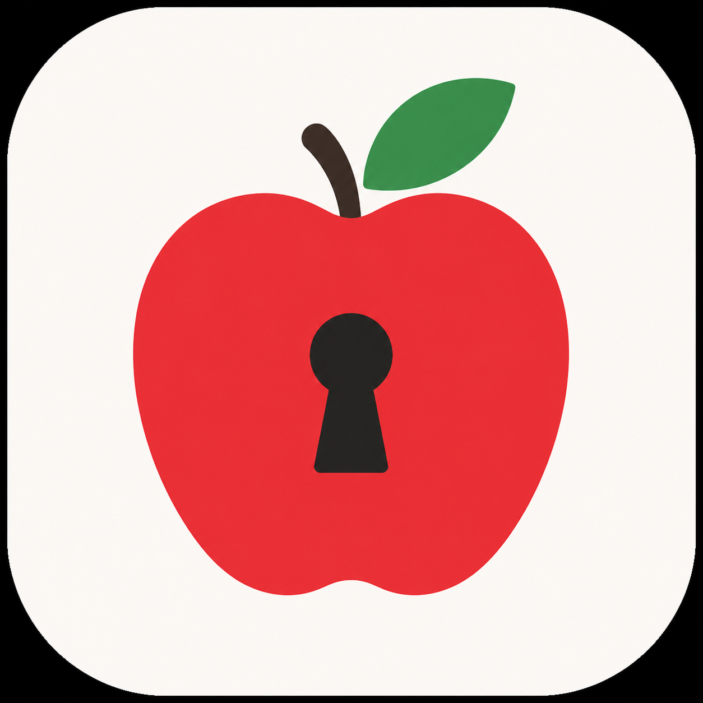

<p align="center">
  
</p>

# API Vault

<p>
  
  
  
</p>

Open-source, cross-platform API key management for desktop and CLI.

API Vault is a local-first vault for storing, organizing, importing, and copying API keys across macOS, Windows, and Linux. The goal is a simple desktop app plus a scriptable CLI, with encrypted storage and no required cloud account.

## Planned Features

| Feature | Preview |
| --- | --- |
| Local encrypted vault for API keys, tokens, and secrets |  |
| Workspaces for separating projects, clients, or apps |  |
| Environment labels like Dev, Staging, and Prod |  |
| Quick search, filtering, and clean table browsing |  |
| One-click copy with masked values by default |  |
| Create, edit, update, and delete secrets in one place |  |
| Import existing `.env` files with preview and conflict handling |  |
| Optional provider, notes, and metadata for each secret |  |
| Cross-platform desktop app for macOS, Windows, and Linux |  |
| CLI for adding, listing, importing, exporting, copying, and scripting secrets |  |

## Feature Scope

API Vault should cover the visible Isla-style feature set without cloning the product blindly:

- Local-first storage with no required cloud sync
- Secure encrypted vault unlock flow
- Workspace creation and switching
- Secret creation form
- Secret list/table view
- Masked secret values
- Search secrets
- Environment filters and multi-environment tagging
- Provider field
- Notes field
- Copy secret value
- Edit and update secrets
- Delete secrets
- Import `.env` files
- Import preview before saving
- Import conflict strategy such as skip, overwrite, or rename
- Import status and error reporting
- Cross-platform packaging for macOS, Windows, and Linux
- CLI commands for everyday workflows
- Open-source license and public development

## CLI Goals

```bash
apivault init
apivault add OPENAI_API_KEY
apivault list --workspace my-app
apivault copy OPENAI_API_KEY
apivault import .env --workspace my-app --env dev
apivault export --format env
```

## License

MIT
